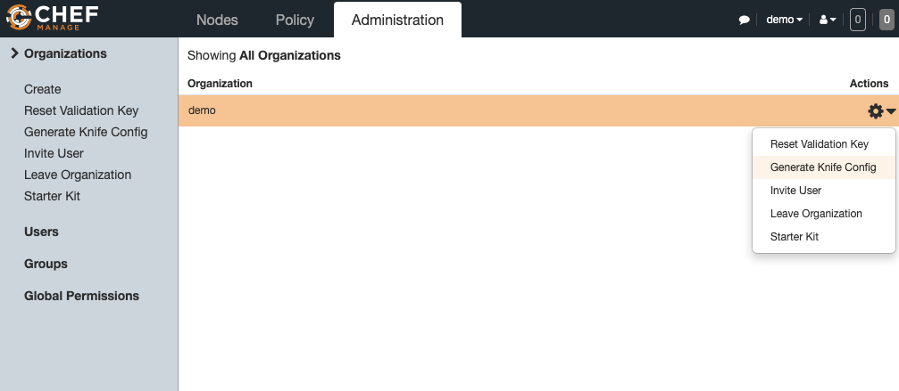

# Chef Workstation Installation

## For MacOS users
```bash
brew install --cask chef-workstation
```

## Linux Install
```bash
sudo yum -y install https://packages.chef.io/files/stable/chef-workstation/21.10.640/el/8/chef-workstation-21.10.640-1.el8.x86_64.rpm
```

## verify the Installation
```bash
chef -v
```

## Generate a Repo
This command creates a directory in the **pwd**
```bash
chef generate repo chef-repo
```

## Verify the Repo
```bash
ls -l chef-repo/
total 12
-rw-r--r--. 1 opc opc 1252 Jul  9 21:02 chefignore
drwxr-xr-x. 3 opc opc   38 Jul  9 21:02 cookbooks
drwxr-xr-x. 3 opc opc   38 Jul  9 21:02 data_bags
-rw-r--r--. 1 opc opc   70 Jul  9 21:02 LICENSE
drwxr-xr-x. 2 opc opc   23 Jul  9 21:02 policyfiles
-rw-r--r--. 1 opc opc 1349 Jul  9 21:02 README.md
```

## Create a hidden Directory inside a repo 
```bash
mkdir chef-repo/.chef
```

## Copy the PEM key files from Chef Server to Workstation
```bash
scp -p /etc/chef/*.pem opc@workstation:~/chef-repo/.chef/
```

### Generate a Knife config on the Chef Server


The sample Knife configuration file would look like this:
```
# See https://docs.chef.io/workstation/config_rb/ for more information on knife configuration options


current_dir = File.dirname(__FILE__)
log_level                :info
log_location             STDOUT
node_name                "admin"
client_key               "#{current_dir}/admin.pem"
chef_server_url          "https://chef.public.toronto.oraclevcn.com/organizations/demo"
cookbook_path            ["#{current_dir}/../cookbooks"]
```

## Upload the Knife Configuration file to the Workstation
Make sure to rename the file to knife.rb
```bash
scp -p config.rb opc@155.248.218.110:~/chef-repo/.chef/knife.rb
```


## Authenticate the Workstation with Chef Server
```bash
pwd
/home/opc/chef-repo

# copy SSL certificates from a Chef HTTPS server to the trusted_certs_dir directory that is used by knife and Chef Infra Client to store trusted SSL certificates.
knife ssl fetch

knife ssl check

# Use the list argument to view a list of registered API client.
knife client list
```


## References
[Downloads](https://docs.chef.io/workstation/install_workstation/#linux)