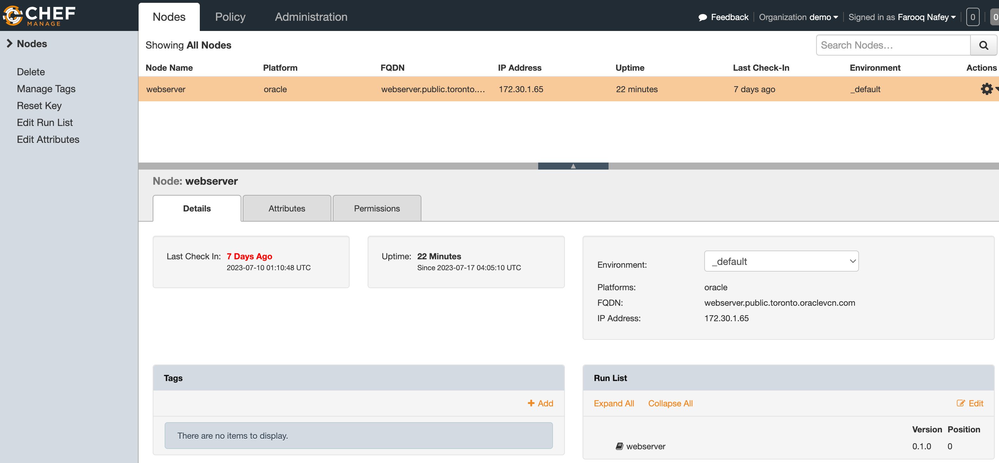

# Client Server Model in Chef

## Upload Cookbooks to Chef Server
```bash
knife cookbook upload webserver
Uploading webserver    [0.1.0]
Uploaded 1 cookbook.
```

The cookbok is now visible from the Console


**There are two ways the Cookbooks can be executed on the client nodes**

### Method 1. Using Console and Chef Client utility
Assign the Cookbook to the appropriate Clint Nodes using Console


Next, On the client machine execute the cookbook using the chef-client utility

Perform a Verification
```bash
[opc@webserver ~]$ sudo chef-client --why-run
```

Run a Cookbook
```bash
[opc@webserver ~]$ sudo chef-client
Chef Infra Client, version 17.10.3
Patents: https://www.chef.io/patents
Infra Phase starting
Resolving cookbooks for run list: ["webserver"]
Synchronizing cookbooks:
  - webserver (0.1.0)
Installing cookbook gem dependencies:
Compiling cookbooks...
Loading Chef InSpec profile files:
Loading Chef InSpec input files:
Loading Chef InSpec waiver files:
Converging 3 resources
Recipe: webserver::apache
  * dnf_package[httpd] action install
    - install version 0:2.4.37-56.0.1.module+el8.8.0+21057+13668aee.6.x86_64 of package httpd
  * file[/var/www/html/index.html] action create
    - create new file /var/www/html/index.html
    - update content in file /var/www/html/index.html from none to 2d77ca
    --- /var/www/html/index.html	2023-07-17 04:36:42.899946032 +0000
    +++ /var/www/html/.chef-index20230717-2177055-fynvz.html	2023-07-17 04:36:42.898946016 +0000
    @@ -1 +1,2 @@
    +This web page is created by Chef Cookbook
    - restore selinux security context
  * systemd_unit[httpd] action start
    - starting unit: httpd
  * systemd_unit[httpd] action enable
    - enabling unit: httpd

Running handlers:
Running handlers complete
Infra Phase complete, 4/4 resources updated in 24 seconds
```


> However, this is not practical if you need to execute to execute the cookbook to multiple client nodes

### Method 2. Using Knife utility from Workstation 
Check the Node list
```bash
knife node list
webserver
```
Verify the Node status
```bash
knife node show webserver
Node Name:   webserver
Environment: _default
FQDN:        webserver.public.toronto.oraclevcn.com
IP:          172.30.1.65
Run List:
Roles:
Recipes:     webserver, webserver::default, webserver::apache
Platform:    oracle 8.7
Tags:
```
> Notice, the **Run List** option of the host. I have already removed the Run List manually using the console. This was done earlier to demonstrate Method 1

Add, a Run List to the node
```bash
[opc@workstation chef-repo]$ knife node run_list add webserver "recipe[webserver]"
webserver:
  run_list: recipe[webserver]
```

```bash
[opc@workstation chef-repo]$ knife node show webserver
Node Name:   webserver
Environment: _default
FQDN:        webserver.public.toronto.oraclevcn.com
IP:          172.30.1.65
Run List:    recipe[webserver]
Roles:
Recipes:     webserver, webserver::default, webserver::apache
Platform:    oracle 8.7
Tags:
```
> Notice, the Run List is now updated for the node

Verify the execution of Run List from workstation
```bash
[opc@workstation chef-repo]$ knife ssh --ssh-user opc 'name:webserver' 'sudo chef-client --why-run'
```

Once verified, execute the Run List
```bash
[opc@workstation chef-repo]$ knife ssh --ssh-user opc 'name:webserver' 'sudo chef-client'
webserver.public.toronto.oraclevcn.com Chef Infra Client, version 17.10.3
webserver.public.toronto.oraclevcn.com Patents: https://www.chef.io/patents
webserver.public.toronto.oraclevcn.com Infra Phase starting
webserver.public.toronto.oraclevcn.com Resolving cookbooks for run list: ["webserver"]
webserver.public.toronto.oraclevcn.com Synchronizing cookbooks:
webserver.public.toronto.oraclevcn.com   - webserver (0.1.0)
webserver.public.toronto.oraclevcn.com Installing cookbook gem dependencies:
webserver.public.toronto.oraclevcn.com Compiling cookbooks...
webserver.public.toronto.oraclevcn.com Loading Chef InSpec profile files:
webserver.public.toronto.oraclevcn.com Loading Chef InSpec input files:
webserver.public.toronto.oraclevcn.com Loading Chef InSpec waiver files:
webserver.public.toronto.oraclevcn.com Converging 3 resources
webserver.public.toronto.oraclevcn.com Recipe: webserver::apache
webserver.public.toronto.oraclevcn.com   * dnf_package[httpd] action install
webserver.public.toronto.oraclevcn.com     - install version 0:2.4.37-56.0.1.module+el8.8.0+21057+13668aee.6.x86_64 of package httpd
webserver.public.toronto.oraclevcn.com   * file[/var/www/html/index.html] action create
webserver.public.toronto.oraclevcn.com     - create new file /var/www/html/index.html
webserver.public.toronto.oraclevcn.com     - update content in file /var/www/html/index.html from none to 2d77ca
webserver.public.toronto.oraclevcn.com     --- /var/www/html/index.html	2023-07-17 05:14:28.131392675 +0000
webserver.public.toronto.oraclevcn.com     +++ /var/www/html/.chef-index20230717-2215417-x6p1vs.html	2023-07-17 05:14:28.131392675 +0000
webserver.public.toronto.oraclevcn.com     @@ -1 +1,2 @@
webserver.public.toronto.oraclevcn.com     +This web page is created by Chef Cookbook
webserver.public.toronto.oraclevcn.com     - restore selinux security context
webserver.public.toronto.oraclevcn.com   * systemd_unit[httpd] action start
webserver.public.toronto.oraclevcn.com     - starting unit: httpd
webserver.public.toronto.oraclevcn.com   * systemd_unit[httpd] action enable
webserver.public.toronto.oraclevcn.com     - enabling unit: httpd
webserver.public.toronto.oraclevcn.com
webserver.public.toronto.oraclevcn.com Running handlers:
webserver.public.toronto.oraclevcn.com Running handlers complete
webserver.public.toronto.oraclevcn.com Infra Phase complete, 4/4 resources updated in 21 seconds
webserver.public.toronto.oraclevcn.com [2023-07-17T05:14:28+00:00] 
```

